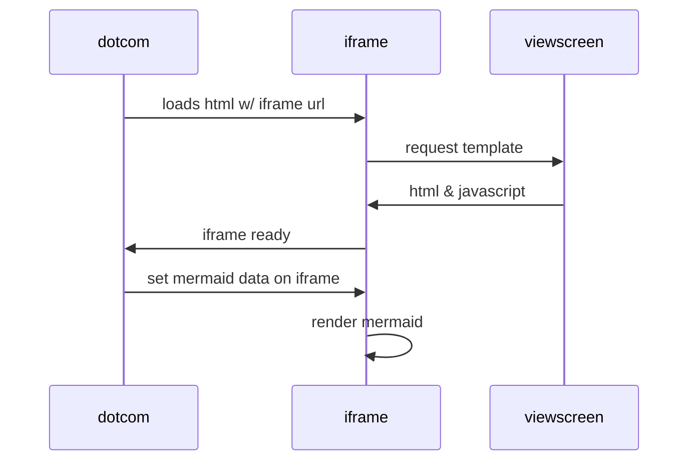

# Walrus ETL App

This repository contains a simple worker service that polls tweets from specified accounts, runs text analysis using an LLM, and writes matches to an output file.

## Prerequisites

* .NET 8 SDK
* Twitter API credentials
* Access to an OpenAI (or Azure OpenAI) endpoint

## Building

```bash
# restore packages and build the solution
 dotnet build WalrusEtl.sln
```

## Running

Set the following environment variables before running:

* `TWITTER_API_KEY` / `TWITTER_API_SECRET`
* `TWITTER_ACCESS_TOKEN` / `TWITTER_ACCESS_SECRET`
* `OPENAI_ENDPOINT` and `OPENAI_KEY`
* `OPENAI_DEPLOYMENT` – the model deployment name

Then execute the worker:

```bash
dotnet run --project WalrusEtl.App
```

Tweets that match the prompt criteria will be appended to `results.jsonl` in JSON Lines format.

## Configuration

Modify `TweetAnalysisWorker.cs` to adjust the list of monitored accounts or change the prompt used when calling the LLM. Prompt templates can be stored in files or environment variables and passed to the worker as needed.


